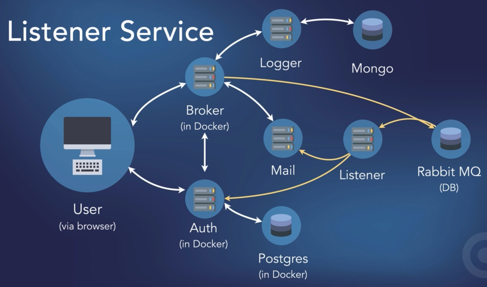

# Go microservices


#### Send test email via mhsendmail
````bash
mhsendmail --smtp-addr="mailhog:1025" test@mailhog.local <<EOF
>From: App <app@mailhog.local>
>To: Test <test@mailhog.local>
>Subject: Test message

>Some content here!
>EOF

````